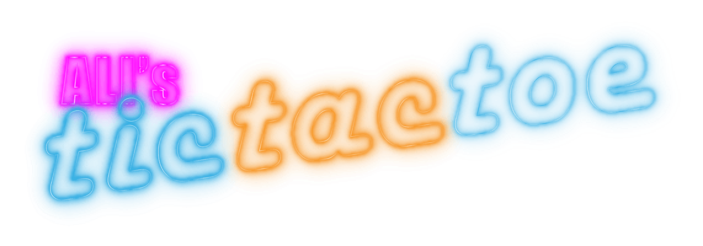

# TicTacToe
The TicTacToe game made with Laravel, VueJS and love!
[Clickez ici pour tester le jeu!](https://neontictactoe.herokuapp.com)

## Installation
Pour installer le projet et jouer sur votre machine, lancez les commandes suivantes depuis le Terminal:

    $ git clone https://github.com/aliisright/TicTacToe.git TicTacToe-Laravel

    $ cd TicTacToe

    $ composer install

    $ créez le fichier .env à partir de .env.example, et changez les configurations de connexion à une base de donnée locale

    $ php artisan migrate

    $ php artisan serv
